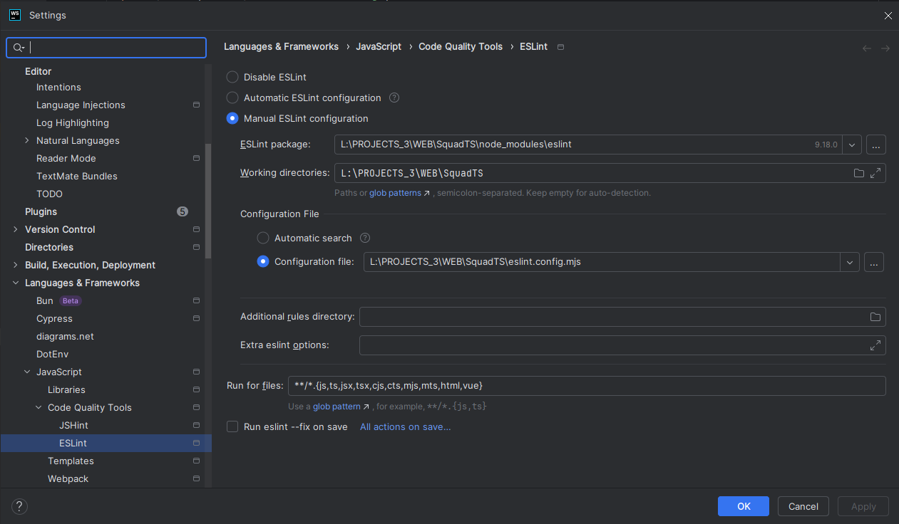
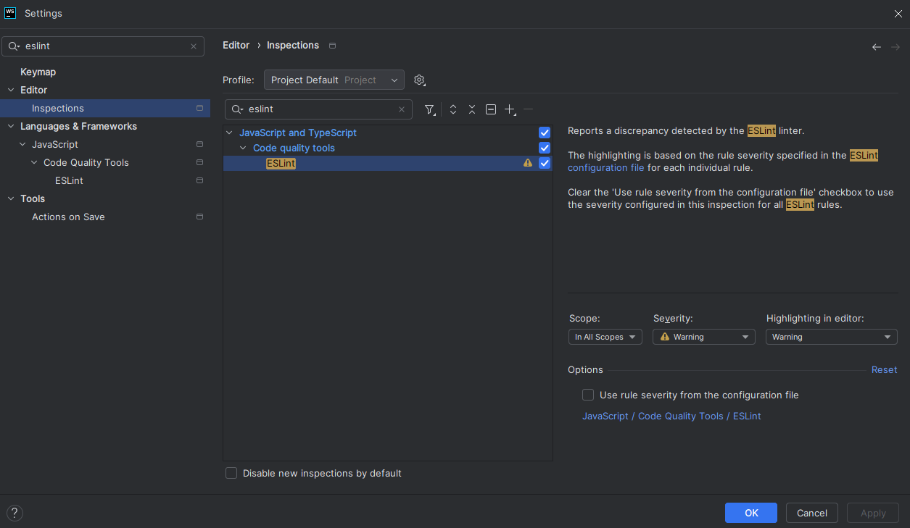

## Cela je vais pas faire, mais pas sur que je vais mettre ds readme final

some plugin like
https://github.com/Ignis-Bots/SquadJS-My-Squad-Stats
and
tools like https://github.com/fantinodavide/Squad_Whitelister
cannot or will not be rewritten by me, too hard, I need to reproduce the exact same data output that SquadJS does,
with all its quirks, to keep backward compatibility, no thanks. Much easier to rewrite for most plugins.
And since SquadJS is not typed, I first need to find the exact type of data that is send by SquadJS....

## IDea

bot kill count plugin (devra utiliser probablement logParser et non
cached-game-status ! car victim nullptr), pr aider à l'attente..

## Aussi intéressant:

creer un script pour load les maps une fois
https://github.com/iamalone98/SquadJS/blob/master/src/core/maps/vanilla.json

cache les layers, ya ds le logs de squad qd tu demarre aussi

https://github.com/Team-Silver-Sphere/SquadJS/pull/372/files#diff-57920470afdfc49129bd5057db6e0b532838db173a9dc17bf2aa78ea633f1248

acces au log depuis exterieur, ex datadog, logstash

---

pre-commit hook pr generate la config ?

---

log parsing lib or some better way to handle logs ?

---

find a way to automatically detect unparsed logs or variation of logs (when Squad update)

---

for ci, ts-node generateconfig.ts -f

---

le double package.json se discute, mais possible ss type module ?

---

IMPORTANT:
Il faut que je change ftp-tail pour non pas pour avoir un sleep, mais pour calculer
le sleep en function du temps que le readFile et downloadfile on prit.

---

any duplicate in reading log regarding rcon execute ?

---

breaking change note: yen a plein, j'ai arreter de compter... bref, bon j'enleve les "raw" des logs, c pas une bonne pratique.
si le format de squad server change, c l'intermediare squadTS/JS qui doit s'en occuper pas les plugins.

---

bug fix (Todo): on devrait plus avoir de undefined.tmp sur le serveur avec ftp-tail
ftp-tail le typing etait chiant a ajouter en d.ts, je suis pas sur la tsconfig qui va bien.
faut changer le sleep dedans pour prendre en compte le temps de downlaod et read.
faut changer la methode watch pr enelver son param comme dit plus haut

---

plugin: roulette russe ? (kick) hehe
PLYUGIN: auto balance, sur vote, et place les gens de meme team ensemble en options

## Log parser max file size

your probably want to reduce to 1MB instead o 10MB when developping.

---

prio:

```
[
    "AltChecker",
    "CBLInfo",
    "DiscordAdminBroadcast",
    "DiscordAdminCamLogs",
    "DiscordAdminRequest",
    "DiscordChat",
    "DiscordFOBHABExplosionDamage",
    "DiscordKillFeed",
    "DiscordRcon",
    "DiscordRoundWinner",
    "DiscordRoundEnded",
    "DiscordServerStatus",
    "DiscordSquadCreated",
    "DiscordTeamkill",
    "PersistentEOSIDtoSteamID",
    "SquadNameValidator",
    "FileLogger",
    "SocketIOAPI",
    "Switch",
    "MaxPlayerInSquad"
]
```

knife truc aussi

---

unmount inutile, ou.. file watch et enlever plugin ?

---

plugin, supporter ancien plugins ou pas ?
entre les deux, faire un adapter pour supporter les anciens plugins, en supportant un format plus neuf aussi.

bon, le shema zod, on va le req pour les nouveaux plugins.
permet d'envoyer le shema ds la fc composition direct

---

no mount or dismount on plugins, unmount never used, restart server after change

---

id are not number but string now.

---

interessant: https://github.com/Squad-Wiki/squad-wiki-pipeline-map-data

---

note about tests: name and ids have been scrambled, and may not be coherent from appear test to test (same player name with different eosID).

todo, ya moyen de s'assurer que les plugins modifie pas ce qui leur aient donné par référence ?

---

todo: si je fais rien des logs initial (potentiellement de la veille...) (on veut pas agir 2 fois sur les meme logs si on
restart squadJS plusieurs fois de suite aussi !!), aussi bien enlever non ?
( en plus niveau logs, cela fait une pause pas forcément bien comprise )

---

when doing a plugins, you may want to add playerTreshold (kick unassigned) and enabledInSeed (squad name validator...)

---

idea: envoyer l user vers un dossier de config different pour plugins et squadTS, pour pouvoir facilement update le projet
ss avoir a merge avec git les config ? puis en dev, je veux une config plugins differentes.

---

lequel ?
server.helper.getByEOSID() ?
server.getByEOSID() ?

pr explorer l'api, c un peu chiant d'avoir plei nde getter partout

server.events
server.rcon.chatEvents
huumm pas naturel ?

---

la CI ou pre-commit hook, devrait regenerer la config (on peut tjrs enlever le hook pr des commit WIP).
si rien a changé tt est bon,si quelque chose a chngé le dev doit faire un commit.

---

(gen plugin config ?)
prq je genere la config si le json5 manque ? cela est pa coherent avec la gen de config de la base squadTS

---

requireConnectors, c du plugin a SquadTS, le user s'en fou et devrait pas y toucher ?
Laisser au plugin le soin d'ajouter en description les requirement ?
et mettre un champs en export pour indiquer ce qui est requis ?

---

plugin enabled par defaut, un peu chiant. par contre c chiant d'avoir litteral(true), et de vouloir
mettre default false... peut etre mettre ts ignore ? c bof mais bon... :////
ou je force enabled false ailleurs ?

---

strucutre pas adapté a plusieurs connecteur, en particulier le required<> typing est pas bon si plusieurs connector

---

todo: DiscordBaseMessageUpdater pr server status

---

refléxion: Ce serait pas mieux d'avoir useSquadServer ds les tests des plugins ?

- Faudrait mock logParser pour sûr
- Faudrait bien envoyer les bons event dans l'ordre avec tout les infos correctes dedans... (genre date, id, teamid, etc)
- Faudrait réussir à mock playerlist rcon Updates, sinon faudrait attendre trop.
- On risque d'avoir besoin d'un helper pour créer les events qui vont bien, en particulier ceux de connection.
- Risque d'envoyer des logs incohérents, innatendu, genre pas de event playerInitialized

---

en passant, si les logs on du retard, tu agis sur des logs quand RCON a déjà update, risque pas d'avoir des choses bizarres ?
en fait, ce qui m'inquiete, c'est que cela se trouve, faut connaitre le fonctionnement interne de SquadServer pour faire les tests.
ce qui est un no-no

---

AUTO-update depuis github ? seulement si pas besoin de input manuel du user... peu probable :/

---

remplacer interval de rxjs par un setTimeout avec observation du retard comme pr ftp tail?
bof ?

---

eslint fix, et prettier,

---

enrefaisant ftp tail, je m'assure que client.disconnect est bien appelé, même en cas de ctrl+c
car sur ma machine il finissait par prendre 3 plombs pour se connecter on dirait (malheureusement pas pu isoler le pb entierement)
et je pense que j'avais trop de connection rester ouverte sur le serveur. 1/3 il plantait et refusais la connection...
plus simple de refaire cette partie que de modifier.

---

mesure la perf. demande cpu, ram
repartir sur le temps de l'interval les events pour réduire les pics de CPU ?

---

idée plugin rating ? pour equilibrage (demande de la BDD pr stockage long terme..)

---

https://github.com/fantinodavide/Squad_Whitelister/blob/main/server.js meh 3700 lines
https://github.com/fantinodavide/SquadJS/blob/de8219d2630fbfd07b355771e1b22853723edd8c/squad-server/plugins/socket-io-api.js#L36
gerer liste d'admin/whitelist. automatique while list temporaire pour seeder.
tt est utile il semble. dapres pika

https://github.com/Ignis-Bots/SquadJS-My-Squad-Stats

IMO, for both, just let SquadJS handle them

## https://github.com/ar1ocker/SquadJS-Commander-Vote

save log ds file pr aider a debug

---

auto back to seed if no player ? i dont remember if squad alraedy does that or battlemetric

mes logs sont encore triplé...

---

heli crash suicide pas appelé, et pb de logs dupliqué...

---

```
[22:15:22.865] WARN: [LogParser] No match on line: [2025.02.12-21.13.34:523][360]LogSquad: Warning: Suicide -TWS- Yuca
```

should also handle suicide by "Respawn" I suppose, better than watching playerWounded !

---

https://github.com/fantinodavide/squad-js-map-vote
map vote lui meme pas necessaire, par contre, le end match peut etre bien.

---

script pr dll log du serveur (a des fins de tests ou observation...)
ce serait sympa de ensuite pouvoir le feed au server pour répéter un bug ? (faudrait les responses rcon pour pouvoir faire cela propre idéalement).

---

pr meilleurs tests...
mettre de quoi lire les logs séparement du reste du server ? lire et tranformer en objet voir event des logs...
en gros, changer logReader et rcon et rcon-updates garder le reste ?
l'idée c'est d'envoyer des morceaux de logs et rcon list players et squad list pour obtenir un teste plus fiable.

---

opti:
.share at tt les events?

---

ListPermittedCommands 1 -> extraire donnée
les mettres en "rcon.extra" ? (bof sur la longue)
ListCommands 1

---

log ds file, et aussi chatEvents separement?

---

faut un moyen de recup les logs du server facilement, si bug, donc en continue, et sur demande

---

t obligé de géré les options, sinon, c'est trop random le résultat, et en gerant les options tu geres aussi quel plugins du enable?

---

gestion des date en test... rcon events...

---

load que certain plugins ?

---

zod parse mais en refusant les props en trop ? (c possible me semble, idée c de
indiquer si des trucs on changé et doivent être enlever si obsolète)
( de même, ce serait bien si les defaults... était pas défault dans la validation :/ )

---

eslint config in webstorm, it may not automatically be correctly set because using eslint.config.mjs instead of eslintrc.


---

recommend unchecking from file
because it is too easy to confuse with TS errors (that actually needs immediate fixing)



---

utils to download FTP logs from before ?

---

todo release, permet d'avoir changelog et master dispo pour merge les trucs en dev.

---

https://github.com/fantinodavide/Squad_Whitelister

google doc, en ligne, et on peut le query régulièrement avec ftp pr update le fichier. Force
SquadTS à rendre accessible son FTP au plugin (pas contre file system je vais)...
embetant niveau secu si un plugin malveillant dont on lit pas le code...

---

soucis: depuis refactor use-game-status (ou avant ?) j'ai plus le SIGINT qui fonctionne correctement.

---

je suis certain que list player est set avant ?

      playerKicked: rconSquad.chatEvents.playerKicked.pipe(
        map(data => ({
          ...getPlayerByEOSID(data.eosID)!,
          ...data,
        }))
      ),

avec le refactor use game status oui

---

prettier auto ?

`match.groups ?? {} as ObjectFromRegexStr<typeof regex>`
is prettified to `match.groups ?? ({} as ObjectFromRegexStr<typeof regex>)`
which is wrong, correct is `(match.groups ?? {}) as ObjectFromRegexStr<typeof regex>`
avec les merge request cela devrait être ok...

---

rappel sigint et sigterm fonctionne plus

---

fetch admin list depuis FTP. (en vrai, prq une liste par http ? étrange non, le jeu reconnait pas ?)

---

roll 0-100 plugin

---

faire admin vote ?

---

refine autant d'events que possible

---

faire une liste d'events dispo depuis la page principale. pr donner envie.

---

useCache avec les chat events.

---

prob pas une bonne idée: faire de la validation de params sur les command rcon, par ex:
kick player X, X existe ds cache ? alors ok, sinon erreur. Peut etre pratique
pour trouver les erreurs tôt, mais risque de donner des résultats faux.
Et faut le coder.

Mieux ?
Les code erreurs de retours si ban/kick, mais player deco ou existe pas.
soit je renvoie un code erreur, soit je throw...

---

ce serait pas mal...

    // todo: rename squadID squadIndex everywhere :)
    // todo: rename teamID TeamNumber everywhere (like the game does)

comme ds la description des commandes

```
AdminDisbandSquad <TeamNumber = [1|2]> <SquadIndex> (Disbands the specified Squad)
```
